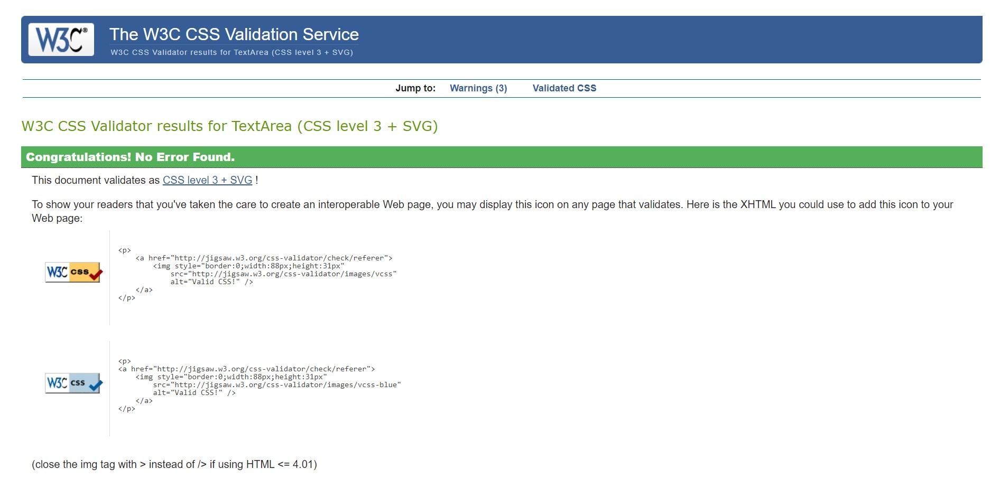

# Lord Of The Rings Quiz 
Lord Of The Rings Quiz is where you can test your knowledge to see how good you are.
 
This Quiz is for the Lord Of The Rings fans who want to test their knowledge overall.
 
This is the Website of <a href=" https://aokealy.github.io/LOTR-Quiz/">Lord Of The Rings Quiz</a>

# User Expierence 
- When being a user I try to make the theme similar to Lord Of The Rings.
- When being a user I want to see the rules.
- When being a user I want to see the buttons easily. 
- When being a user I want to see the extra features.
- When being a user I want to play the game again.

## Site Structure 
- The structure of the Quiz is a home screen where rules and play button are set. 
- When clicking on the quiz there is a score on the top left and a timer on the top right.
- At the bottom of the quiz there is a next button and show results button.
- The show results page will give you the amount of correct and wrong answers.
- There is also a try again button to start the quiz again.

## Typography
- The font that were used in this Quiz was Lato.
- Lato is perhaps the most unique and interesting sans-serif font on this list. It was designed by Łukasz Dziedzic and includes 10 styles. It goes from thin all the way to ultra-bold. The letters in Lato have some unique curves which can only be seen in larger sizes.
## Colour Choice
- The colours I chose for this quiz were #d4af37 (Gold) to represent the One Ring.
- The second colour I chose is #FF7700 (orange) to represent The fire of Mount Doom.
- These colours make a good combination in relation to the movies.

# Features 

This quiz has a few features to make it easy for the user to navigate easily and not get confused when going through the
quiz.  

## Existing Features 

- __Starter Page__
    - The starter page has instructions telling you about what the quiz is about. 
     - The Logo is eye appealing to the user. 
     - There is an a button at the bottom that shows you how to start the quiz.
     
     

 - __Home Page Image__
     - The main image when you view the home page is the eye of Sauron which is an iconic character in the movies.
     - It also blends in nicely with the background image linking to wear he comes from.
                                         

     - __Home Page Content__
         - Inside you have a set of Instruction on how to play the game overall.

         __Quiz Page__
         - The quiz page has a random question asked highlighted to see clearly.
         - Score tracker at the top left to keep track.
         - Timer to let you know how much time you have left in the quiz.
         - Next button in the bottom left to go to next question.
         - Show results button to show how many right and how many wrong questions.

         

         __Timeout__
         - When timer goes down to zero an alert will show up to say the quiz has ended.
         - User will be shown score afterwards.
         - User can then chose to play the game again if they wish.
          

        # Future Features
        - A username to add tp keep track of past scores.
        - A animation of a trophy if you get all correct answers.

        # Technology used:
        - <a href="https://html.spec.whatwg.org/"> HTML5 for HTML </a>
        - <a href="https://www.w3.org/Style/CSS/Overview.en.html">CSS for styling </a>
        - <a href="https://www.gitpod.io/">Gitpod to Deploy </a>
        - <a href="https://github.com/">Github to host </a>
        - <a href="https://fonts.google.com/">Google Fonts for the text</a>
        - <a href="https://jshint.com/">Javascript errors</a>
      
      # Testing 
      ## Home Page
      - In this section I tested the code using <a href="https://validator.w3.org/nu/#textarea">WC3 Validator HTML</a>
       
     
      - Also I tested the code using <a href="https://jigsaw.w3.org/css-validator/">WC3 Validator CSS</a>
         
         
        
    ## Responsive
    - as you can see it scales down when viewing in a different size to keep it's shape so it stays uninterrpted.
          

        - As we get into mobile mode inside the gallery it changes it shape by going off one image so the images are still visable to see. 
          

          - I used Google Developer tool to test the responsiveness of the website.
          ## Lighthouse Test
          
          
          # Browser Test

          ## Mozilla
          

          ## Microsoft Edge
          
          - These are the browser test and I can comfirm they work on Chrome, Firefox and Microsoft Edge.

         

          # Unfixed Bugs
          - I was getting an error called Uncaught TypeError: Cannot read properties of null (reading 'parent')
          - after multiple attemps of trying to fix it I couldn't change the bug.
          - another bug was Failed to load resource the server responded with a status of 404 (Not Found)
          - This is where a path for jquery was not working and I think I fixed but is common when writing code.

          

          # Deployment 
          - This section should describe the process you went through to deploy the project to a hosting platform (e.g. GitHub)
          - The site was deployed to GitHub pages. The steps to deploy are as follows:
          - In the GitHub repository, navigate to the Settings tab
          
          - From the source section drop-down menu, select the Main Branch
          - Once the main branch has been selected, the page will be automatically refreshed with a detailed ribbon display to indicate the successful deployment.
          
         - The live link to the Github repository can be found here: https://github.com/aokealy/LOTR-Quiz
         # To fork the repository on GitHub
        - A copy of the GitHub Repository can be made by forking the GitHub account. This copy can be viewed and changes can be made to the copy without affecting the original repository. Take the following steps to fork the repository;
        - Log in to GitHub and locate the repository.
        - On the right hand side of the page inline with the repository name is a button called 'Fork', click on the button to   create a copy of the original repository in your GitHub Account.
         
         
        
        # To create a local clone of this project
        - Under the repository’s name, click on the code tab.
        - In the Clone with HTTPS section, click on the clipboard icon to copy the given URL.
        - In your IDE of choice, open Git Bash.
        - Change the current working directory to the location where you want the cloned directory to be made.
        - Type git clone, and then paste the URL copied from GitHub.
        - Press enter and the local clone will be created.
         
       
        # Credits
        ## Contents
        - Quiz layout from <a href="https://www.youtube.com/watch?v=Z-HLdIYHjRM">Youtube video</a>
        - Quiz Javascript <a href="https://www.youtube.com/watch?v=Tf9hr4tmhK4">Youtube video</a>
        
        ## Media
        ### Gallery
        - This image was used from <a href="https://www.subpng.com/png-xakzr6/download.html">Sauron Eye Logo</a>
        - This image was used from <a href="https://www.wallpaperflare.com/lord-of-the-rings-mordor-mount-doom-eye-of-sauron-wallpaper-bljap/download/1920x1080">mounth doom wallpaper</a>
        

        # Acknowledgements
        - This quiz is for Project Portfolio two for Code Institue and UCD Academy.
        -  For the Full Stack Software Developer (e-Commerce) Diploma
        
         

        
     
       
     
      
       
